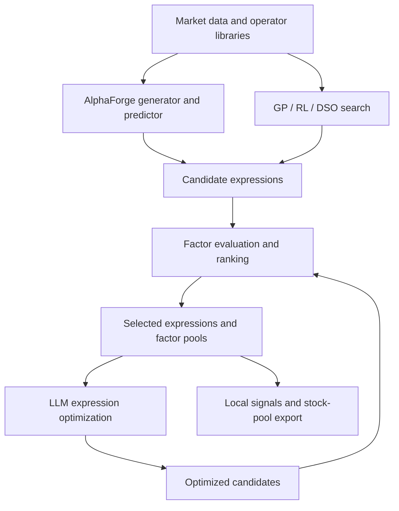

# AFF — AlphaForge Factors

**Automated alpha discovery, evaluation, and feedback-driven optimization.**

AFF builds on the AlphaForge generator–predictor approach to formulaic alpha
research. Developed for convertible-bond factor research, it extends that approach
with configurable data and operator layers, rolling-window experiments, a shared
factor evaluation pipeline, and LLM-assisted expression optimization. Genetic
programming (GP), reinforcement learning (RL), and deep symbolic optimization
(DSO) provide complementary search methods and comparison entry points.

The project addresses a practical research bottleneck: generating many expressions
is useful only when those expressions can be evaluated consistently, filtered for
redundancy, and turned into reusable research artifacts. AFF connects candidate
discovery to evaluation, pool construction, and local signal export so that each
stage can feed the next experiment.

This public edition provides the research code and local-data interfaces. Supply
your own Qlib dataset for training and evaluation, or CSV market data for the
paper-trading workflow. Historical datasets, experiment outputs, and trained
models are excluded.

## Research architecture



AlphaForge is the primary discovery path. The LLM proposes modifications to
selected factors using their expressions and evaluation feedback; the same
pipeline evaluates those variants. GP, RL, and DSO extend the search space through
separate training entry points.

| Research capability | Implementation |
| --- | --- |
| Configurable discovery | Generator–predictor combinations (`cnn_cnn`, `dcgan_netp`, `lstm_netp`), syntax masking, collection thresholds, loss options, and correlation-based pool rebalancing |
| Extensible expressions | Standard, custom, Qlib, and TA-Lib operator groups, with shared expression and data interfaces |
| Temporal experiments | Rolling training, validation, and test windows; configurable seeds, instruments, frequency, and output names |
| Consistent evaluation | Shared backtests, weighted candidate ranking, expression export, and factor-pool construction |
| Feedback optimization | Prompts combining expressions, metrics, operator definitions, and a structured JSON output template |
| Downstream research | Local CSV data loading, optional bond and suspension metadata, signal calculation, and stock-pool export |

The main AFF launcher and training module expose more than 30 default settings.
These are configuration controls, rather than a count of completed experiments.
The default rolling schedule uses 18 months for training, 3 for validation, and
3 for testing, advancing by 3 months per window.

## Research workflow

1. Prepare market data in Qlib format, set `QLIB_PATH`, and configure the universe,
   dates, operator libraries, and model settings.
2. Generate candidate expressions with the main AFF launcher or a complementary
   GP, RL, or DSO search method.
3. Evaluate factor values and portfolio return series across the configured splits.
4. Rank candidates, export selected expressions, and build reusable factor pools.
5. Optionally generate LLM variants and evaluate them through the same pipeline.
6. Calculate signals from local market data and export stock pools for further
   paper-trading research.

## Project structure

| Path | Purpose |
| --- | --- |
| `train_AFF.py`, `aff_module.py` | Sliding-window AlphaForge-based factor discovery |
| `train_GP.py`, `gplearn/` | Genetic programming and expression evolution |
| `train_RL.py`, `alphagen/rl/` | Reinforcement-learning factor search |
| `train_DSO.py`, `dso/` | Deep symbolic optimization |
| `alphagen/data/`, `alphagen/models/` | Expression trees, evaluation interfaces, and alpha pools |
| `alphagen_generic/` | Standard, custom, Qlib, and TA-Lib operators |
| `alphagen_qlib/` | Qlib market-data and factor-calculator adapters |
| `gan/` | Generators, predictors, syntax masks, expression collection, and utilities |
| `backtest/` | Factor evaluation, performance metrics, and analysis |
| `factor_pipeline/` | Six-stage evaluation and pool-building workflow |
| `llm_opt/` | LLM prompts, API adapters, parsing, and factor optimization |
| `paper_trading/` | Local CSV loading, signal calculation, masks, and stock-pool export |
| `data_collection/` | BaoStock data collection and conversion to Qlib binaries |
| `requirements/` | Dependency lists for individual subsystems |
| `md/` | Operator and backtest reference documents |

See [PROJECT_OVERVIEW.md](PROJECT_OVERVIEW.md) for a more detailed module map.

## Environment setup

Run commands from the repository root. The AFF dependency file targets Python 3.10.
Other subsystems have their own dependency lists and version constraints; use a
separate virtual environment for each training method rather than combining all
dependency files. The dependency headers for GP, RL, and DSO mention Python 3.9,
but the actual framework pins also need to support your chosen interpreter and
platform.

For an AFF environment:

```bash
python3.10 -m venv .venv-aff
source .venv-aff/bin/activate
python -m pip install --upgrade pip
python -m pip install -r requirements/req_aff.txt
python -m pip install scipy tqdm python-dateutil
```

Choose the relevant dependency file for other workflows:

| Workflow | Dependency file |
| --- | --- |
| AFF | `requirements/req_aff.txt` |
| GP | `requirements/req_gp.txt` |
| RL | `requirements/req_rl.txt` |
| DSO | `requirements/req_dso.txt` |
| LLM integration utilities | `requirements/req_dft.txt` |

The lists are subsystem-specific and may need additional shared dependencies from
the modules you use. For example, GP uses `tqdm`, and DSO imports the shared
factor-data utilities. TA-Lib operators require an available `talib` installation;
alternatively, select operator tags that are available in your environment.

### Market data

Set an absolute path to an existing Qlib dataset before importing training or
factor-data modules:

```bash
export QLIB_PATH="/absolute/path/to/qlib_data/cn_data"
```

The provider should contain the calendars, instruments, and feature files needed
for your selected market universe and frequency. Local caches are written to
`pkl/`. Review the dates, instrument universe, frequency, and device settings in
the training script before launching a run.

The stage-2 backtester can accept a `qlib_path` when called programmatically.
Without an explicit argument, `FactorData` uses `QLIB_PATH`.

`data_collection/fetch_baostock_data.py` provides an A-share collection workflow
and invokes `qlib_dump_bin.py` to export Qlib binaries. Its main block contains
local paths and a forward-adjustment date that should be configured for your data.

## Factor discovery

### AlphaForge-based discovery

AFF trains over sliding windows with separate training, validation, and test
periods. The generator proposes expressions, a syntax masker constrains token
sequences, and a predictor estimates expression quality. Accepted factors are
filtered and rebalanced into a pool.

```bash
python train_AFF.py --start_date=2022-01-01 --end_date=2024-12-31
```

`train_AFF.py` exposes its sliding-window function through Python Fire. Configure
the window lengths, seeds, instrument universe, frequency, and device there.
`aff_module.py` contains model settings, collection thresholds, loss options,
masking, and pool-rebalancing controls. Supported model configurations are
`cnn_cnn`, `dcgan_netp`, and `lstm_netp`.

Operator libraries are selected with comma-separated tags: `std`, `cstm`, `qlib`,
and `talib`. The AFF default selects all four. Change the selection if an optional
library is unavailable. The current AFF launcher selects CUDA only when
`DEFAULT_CUDA > 0` and CUDA is available; its default value of `0` selects CPU.

### Other search methods

```bash
python train_GP.py
python train_RL.py
python train_DSO.py
```

GP and RL use the configuration constants in their scripts. DSO also exposes a
Python Fire entry point. These scripts configure different data ranges, pool
capacities, search budgets, seeds, and output naming conventions. Review each
script's configuration before running it.

## Evaluation and factor pools

The backtest exports contain 18 core metrics: `IC`, `RankIC`, and `ExcessIC`,
plus annualized return, cumulative return, Sharpe ratio, win rate, and maximum
drawdown for each of three portfolio views: long excess, long–short, and long
absolute. Training also uses IC/ICIR and RankIC/RankICIR thresholds where enabled.
The selection stage combines configurable metric weights; pool construction and
training controls help manage candidate redundancy.

Run the factor pipeline against a completed training directory under `out/`:

```bash
python factor_pipeline/factor_pipeline.py \
  --run-dir YOUR_RUN_DIRECTORY --steps 1:6 --mode dft
```

| Stage | Script | Result |
| --- | --- | --- |
| 1 | `1_factor_process.py` | Factor series and an expression inventory |
| 2 | `2_factor_backtest.py` | Backtest tables for the configured data splits |
| 3 | `3_factor_select.py` | Weighted ranking, factor selection, and statistics |
| 4 | `4_factor_json.py` | Selected expressions in JSON format |
| 5 | `5_factor_builder.py` | Factor builders and exported CSV/pickle artifacts |
| 6 | `6_factor_pool.py` | Integrated factor pool and statistics |

The orchestrator accepts step ranges such as `1:6` and `3:6`. Stage-specific
settings, including selection weights and limits, are defined in the individual
scripts. `dft` processes the original candidates; `opt` processes optimized
variants. Use the same run directory throughout evaluation and optimization.

Stage 5 writes to `out/<RUN_DIR>_0` in `dft` mode and `out/<RUN_DIR>_` in `opt`
mode. Stage 6 integrates those artifacts into `pool/<RUN_DIR>_0` and
`pool/<RUN_DIR>`, respectively.

Generated artifacts are organized under:

- `out/`: training results and rebuilt factor artifacts.
- `analysis/`: factor series, backtests, selections, and LLM output.
- `pool/`: integrated pools for downstream use.
- `pkl/`: cached market data.

These directories are ignored by Git. The operator and metric references are
[md/operators.md](md/operators.md) and [md/backtest.md](md/backtest.md).

## LLM optimization

Configure `API_MODE`, `DEFAULT_MODEL_NAME`, and `RUN_DIR` in
`llm_opt/llm_config.py`. The available API modes are `openai`, `deepseek`, and
`expected_parrot`. Supply the corresponding credential through the environment
or a local `.env` file:

```dotenv
OPENAI_API_KEY=your_key
DEEPSEEK_API_KEY=your_key
EXPECTED_PARROT_API_KEY=your_key
```

Run optimization after generating the selected-factor JSON and backtest results:

```bash
python llm_opt/llm_main.py
```

The prompt combines selected expressions, backtest results, operator definitions,
and a JSON output template. It requests the original factor plus nine variants,
with English names and descriptions. Results are saved to
`analysis/<RUN_DIR>/llm/llm_opt.json`; evaluate them with the pipeline's `opt` mode.

## Local-data paper trading

The paper-trading workflow reads user-supplied CSV files and writes stock pools
locally. It has no built-in database connection or remote data-warehouse adapter.

Create an instrument metadata CSV, for example:

```csv
tr_code
DEMO
```

Provide `data/daily/DEMO.csv` with these columns:

```csv
time,open,high,low,close,volume
2024-01-02,100,102,99,101,1000
2024-01-03,101,103,100,102,1200
```

These rows are illustrative synthetic values. A real factor run needs enough
history for the configured lookback and operator windows. The loader validates
columns, sorts dates, and keeps the last row for duplicate dates. Supply only
data that you are allowed to use.

For a single factor from a generated pool:

```bash
python -m paper_trading.pt_main \
  --data-dir data/daily --instruments data/instruments.csv --output exports \
  -m sgl -d YOUR_POOL_DIRECTORY -n YOUR_FACTOR_INDEX -s research_pool
```

For multiple factors:

```bash
python -m paper_trading.pt_main \
  --data-dir data/daily --instruments data/instruments.csv --output exports \
  -m mpl -d YOUR_POOL_DIRECTORY -s 'research_{factor}' \
  --sort test_ExcessIC --desc true --limit 10
```

Choose a sorting column present in `pool/<directory>/factor_stats.csv`. Each
produced pool is exported as a CSV under the output directory. Optional bond
metadata uses English `bond_code`, `stock_code`, and `subscription_date` columns;
subscription dates are Unix timestamps in milliseconds. Optional suspension
metadata passed with `--suspensions` has `time` and `tp_codes` columns, where
`tp_codes` contains a JSON array of instrument codes.

Historical backtest metric headers remain readable through a local compatibility
adapter. New outputs and all application-facing fields use English names.

## Development

Compile Python sources without starting training or contacting market services:

```bash
python -m compileall -q alphagen alphagen_generic alphagen_qlib backtest \
  data_collection dso factor_pipeline gan gplearn llm_opt paper_trading \
  aff_module.py train_AFF.py train_DSO.py train_GP.py train_RL.py
```

Run the local-data and English-schema checks in an environment with pandas,
NumPy, PyTorch, tqdm, and python-dotenv:

```bash
python -m unittest discover -s tests -v
```

The vendored GP package includes tests under `gplearn/tests/`. Full training and
integration checks require the corresponding dependencies, market data, and
service access.

## Research scope and reproducibility

This release supports source-level inspection and experiments on user-supplied
data. Its defaults and separate method launchers are starting points for research;
reproducing a comparison requires aligned data, operators, time splits, search
budgets, and recorded configurations across methods.

No benchmark returns or candidate-pool counts are presented as reproduced results
of this public release. Historical research outcomes require their original data,
logs, selection history, and evaluation assumptions. Keep a final holdout separate
from candidate selection, including selection among LLM-generated variants.
Portfolio statistics should be interpreted with the benchmark, annualization,
transaction-cost, and liquidity assumptions used by the evaluation code.

The local paper-trading module exports signals and stock pools. Brokerage execution
and a complete live portfolio-management loop are outside this release.

## Acknowledgments

AFF builds on the AlphaForge research approach. Parts of the code also refer to
or adapt work from
[AlphaGen](https://github.com/RL-MLDM/alphagen),
[Deep Symbolic Optimization](https://github.com/dso-org/deep-symbolic-optimization),
and [Qlib](https://github.com/microsoft/qlib). The repository also contains a
modified `gplearn` package. Keep upstream attribution and licensing notices when
reusing those components.

## Public distribution

This repository contains source code and a fresh Git history. Local credentials,
market datasets, caches, trained models, and generated outputs are excluded.
Use [.env.example](.env.example) for optional local configuration. Run
`python scripts/audit_publication.py` to check tracked and non-ignored files before
publishing changes. See
[THIRD_PARTY_NOTICES.md](THIRD_PARTY_NOTICES.md) for upstream attributions and
license texts, and [SECURITY.md](SECURITY.md) for reporting security issues.
